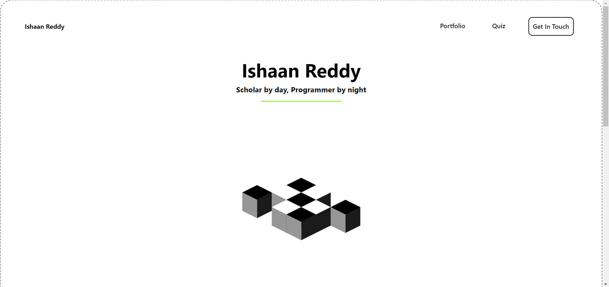
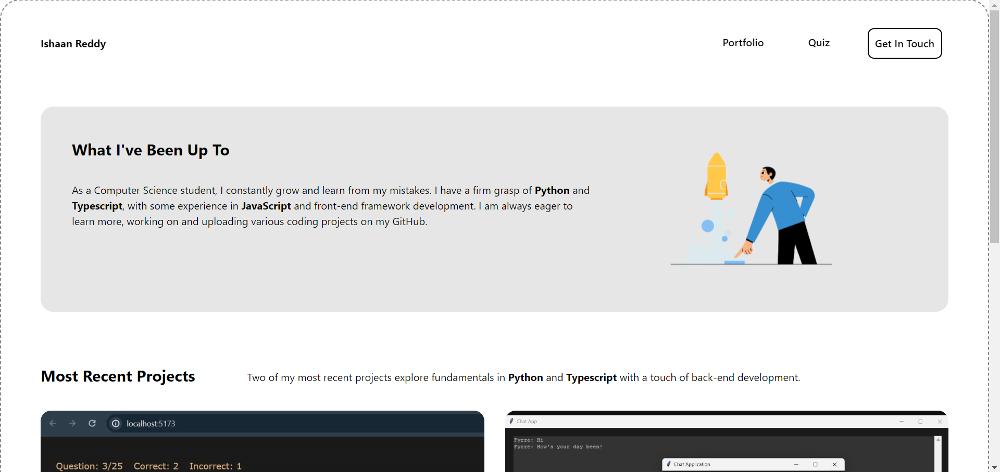
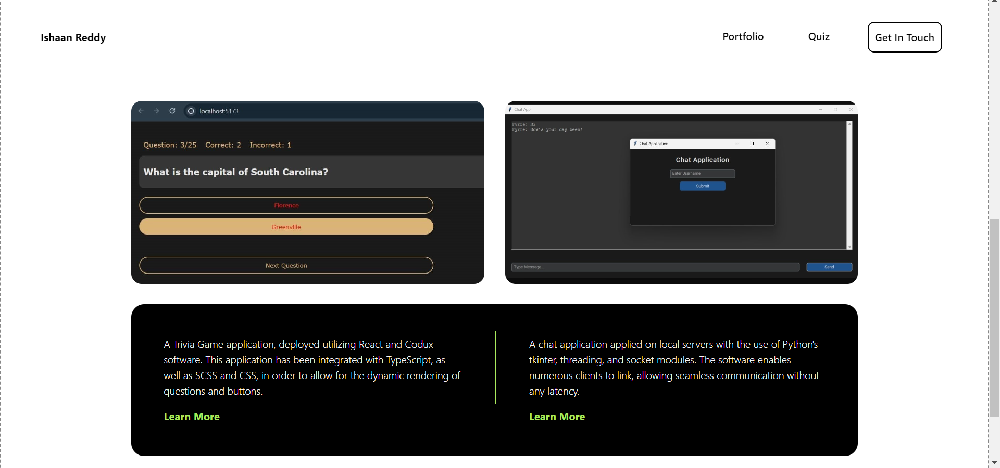
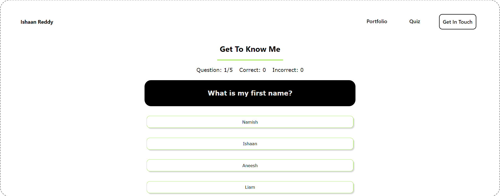
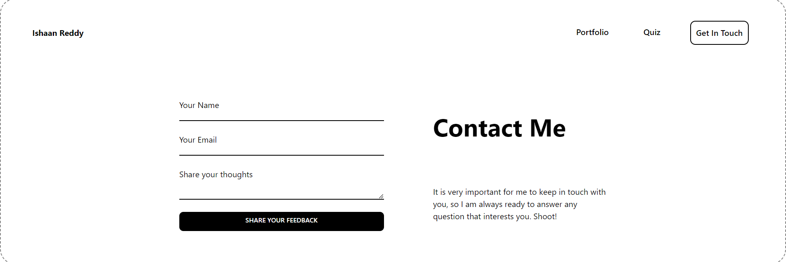

  
    <h1>React Portfolio Website</h1>

### Visual IDE
This project was bootstrapped with [`Codux`](https://www.codux.com/) and [`Vite`](https://vitejs.dev).

- Edited, rendered, and composed an app that makes use of **`React`**-based components.
- Created components with **`TypeScript`**, **`SCSS`** and **`CSS Modules`** support.
- Visually edited in real-time and in an isolated environment.

### Available Scripts

In the project directory, you can run:

### `npm run build`

Build the application in production mode into a folder named `dist`. This folder can be served using any HTTP server.

### `npm run dev`

Start dev server, aliases: `vite dev`, `vite serve`.\
Open [http://127.0.0.1:5173/](http://127.0.0.1:5173/) to view it in the browser.

### `npm run preview`

Boots up a local static web server that serves the files from dist at [`http://localhost:4173`](http://localhost:4173) . It's an easy way to check if the production build looks OK in your local environment.

## Implementation

### Home

### Portfolio

### Quiz

### Contatc

